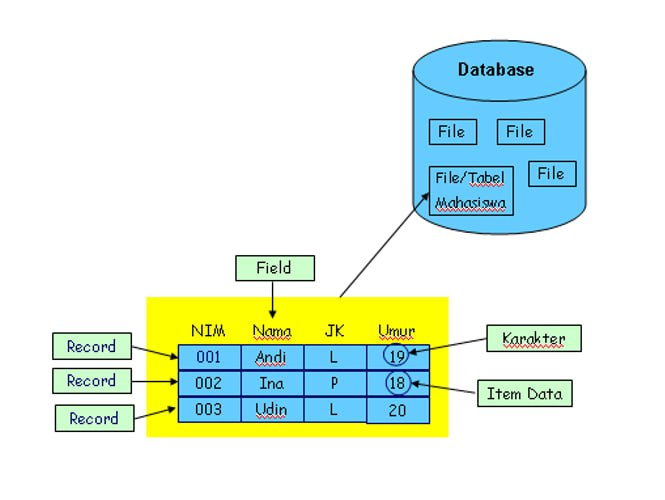

# Definisi Basis Data


## Data
-pernyataan apa adanya
-representasi fakta didunia nyata
-sekumpulan fakta dari sebuah
contoh=nama,nis,tgl,jenis kelamin dst

## informasi
-data yang telah diolah agar lebih bermakna
contoh= -lampu merah maka kendaraan tidak boleh melintas
        -suhu kelas sekarang 38 celcius bearti kelas sangat panas

## base/basis 
basis adalah wadah/tempat 

## basis Data
-definisi ringkas
sekumpulan pernyataaan
-definisi internet
Basis data adalah kumpulan informasi atau keterangan yang diolah agar bisa diakses, di proses, dikelola, dan diperbarui dengan mudah. Database biasanya berisi kumpulan catatan atau arsip informasi tentang transaksi penjualan maupun pelanggan tertentu. Database secara umum disimpan dan diakses secara dari sistem komputer.

## Aplikasi Basis data

## MYSQL
MySQL adalah [DBMS](https://www.niagahoster.co.id/blog/dbms-adalah/) yang open source dengan dua bentuk lisensi, yaitu Free Software (perangkat lunak bebas) dan Shareware (perangkat lunak berpemilik yang penggunaannya terbatas).

Jadi, MySQL adalah database server yang gratis dengan lisensi GNU General Public License (GPL) sehingga dapat Anda pakai untuk keperluan pribadi atau komersil tanpa harus membayar lisensi yang ada.

Seperti yang sudah disinggung di atas, MySQL masuk ke dalam jenis RDBMS (Relational Database Management System). Maka dari itu, istilah semacam baris, kolom, tabel, dipakai pada [aplikasi database](https://www.niagahoster.co.id/blog/database-terpopuler/) ini. Contohnya di dalam MySQL sebuah database terdapat satu atau beberapa tabel.

SQL sendiri merupakan suatu bahasa yang dipakai di dalam pengambilan data pada relational database atau database yang terstruktur. Jadi MySQL adalah database management system yang menggunakan bahasa SQL sebagai bahasa penghubung antara perangkat lunak aplikasi dengan database server..
## MariaDB
MariaDB adalah **sistem manajemen database yang merupakan pengembangan mandiri dari MySQL**. MariaDB juga disebut fork karena dianggap sebagai versi lain MySQL. Dikembangkan pada tahun 2009, MariaDB hadir sebagai aplikasi Relational Database Management Systems yang sifatnya masih open source.


## MongoDB
**MongoDB adalah sistem database yang populer di kalangan pengembang perangkat lunak**. MongoDB dirancang menggunakan pendekatan NoSQL (Not Only SQL), di mana [NoSQL adalah](https://www.niagahoster.co.id/blog/nosql-adalah/) sistem pengelolaan database yang fleksibel dan tidak membutuhkan perintah atau query yang rumit.

Berbeda dengan database relasional tradisional yang masih menggunakan struktur tabel dan skema, MongoDB menyimpan data dalam format BSON (Binary JSON). Dengan format yang mirip [JSON](https://www.niagahoster.co.id/blog/json-adalah/), proses baca tulis data menjadi lebih mudah dan cepat.

Tidak hanya itu, database MongoDB juga menyediakan beragam fitur yang mendukung [pengembangan website](https://www.niagahoster.co.id/blog/website-development-adalah/) dan aplikasi. Misalnya, integrasi dengan berbagai bahasa pemrograman populer, kemampuan mengelola query yang kuat, serta pencarian dan pemrosesan data yang efisien.

Dengan menggunakan MongoDB, Anda dapat mengoptimalkan pengelolaan data di dalam database, sehingga kinerja sistem secara keseluruhan jadi lebih meningkat.


## 1.Tuliskan contoh penerapan basis data berbagai sektor seperti rumah sakit ,perpustakaan,sekolah,industri swasta ,pemerintahan,dan sebagainya jelaskan paling tidak 3 sektor penerapan data

***1.Rumah sakit***
- **Penerapan:** Rumah sakit menggunakan basis data untuk mengelola informasi pasien, rekam medis, penjadwalan janji temu, inventaris obat, dan manajemen staf.
- **Contoh:**
- **Rekam Medis Elektronik (EMR):** Menyimpan data kesehatan pasien, termasuk diagnosis, riwayat medis, hasil laboratorium, dan resep obat.
- **Sistem Informasi Rumah Sakit (HIS):** Mengintegrasikan berbagai fungsi seperti administrasi, keuangan, dan logistik.
- **Sistem Manajemen Laboratorium:** Mengelola data hasil tes laboratorium, sehingga dokter dapat dengan mudah mengakses hasil tes pasien.

***2.Perpustakaan***
- **Penerapan:** Perpustakaan menggunakan basis data untuk mengelola koleksi buku, majalah, jurnal, dan media lainnya, serta informasi peminjam.
- **Contoh:**
- **Sistem Informasi Manajemen Perpustakaan:** Melacak informasi koleksi, status peminjaman, dan histori peminjaman pengguna.
- **Katalog Online Akses Publik (OPAC):** Memungkinkan pengguna untuk mencari dan menemukan sumber daya yang tersedia di perpustakaan.
- **Sistem Keanggotaan:** Mengelola data anggota perpustakaan, seperti pendaftaran, peminjaman, dan pengembalian.
    
***3.Pemerintahan***
- **Penerapan:** Pemerintah menggunakan basis data untuk berbagai fungsi, seperti pengelolaan data penduduk, layanan publik, dan administrasi keuangan.
- **Contoh:**
- **Sistem Registrasi Kependudukan:** Menyimpan data penduduk seperti nama, alamat, nomor identitas, status pernikahan, dan lainnya.
- **Sistem Pajak:** Mengelola informasi wajib pajak, pembayaran pajak, dan penerimaan pajak.
- **Sistem Informasi Geografis (GIS):** Mengelola data geografis dan spasial untuk perencanaan tata kota, pengelolaan lahan, dan pemetaan.


## 2. Jelaskan dan berikan contoh  komponen basis data 

**A. Basis data:**
    -**penjelasan**: Kumpulan data yang terorganisir yang memungkinkan untuk diakses dikelola dan diperbarui dengan mudah. Basis data menyipan informasi yang saling terkait dalam suatu sistem 
    **contoh:** Sistem basis data rumah sakit yang menyimpan data pasien,jadwal dokter dan inventaris obat.

**B. Tabel:**
     **Penjelasan:** Struktur dalam basis data yang menyimpan data dalam format baris dan kolom. Tabel adalah unit dasar penyimpanan dalam basis data.
     **contoh:** Tabel "pasien" yang berisi data 

**C. Kolom**
    **Penjelasan:** Atribut atau field dalam tabel yang menyimpan jenis data tertentu. Kolom mendefinisikan tipe data yang disimpan dalam setiap entri pada tabel.
    **Contoh:** Kolom "Nama" dalam tabel "Pasien" yang menyimpan nama-nama pasien.
 
**B. Baris:**
    **penjelasan**: Rekaman atau record dalam tabel yang menyimpan data lengkap untuk satu entitas. Baris adalah unit individu yang menyimpan data untuk setiap item dalam tabel.
    **Contoh:** Baris dalam tabel "Pasien" yang menyimpan data lengkap untuk satu pasien tertentu, seperti ID pasien, nama, alamat, dan tanggal lahir.


## 3. Berikan penjelasan tentang tiga bahasa didalam basis data yaitu.
**A. DDL**
 **Data Definition Language (DDL)**
    **Definisi**: Data Definition Language (DDL) adalah sekumpulan perintah dalam SQL (Structured Query Language) yang digunakan untuk mendefinisikan dan mengelola struktur basis data. DDL fokus pada pembuatan, modifikasi, dan penghapusan objek-objek basis data seperti tabel, indeks, dan skema.
    
**Perintah Utama dalam DDL**
 1. **CREATE:**: Digunakan untuk membuat objek-objek baru dalam basis data, seperti tabel, indeks, atau tampilan (view). Contoh perintah `CREATE TABLE` digunakan untuk mendefinisikan tabel baru dengan nama dan kolom-kolom yang diperlukan.

**B. DML**
 **Data Manipulation Language (DML)**
    **Definisi**: Data Manipulation Language (DML) mencakup perintah-perintah SQL yang digunakan untuk memasukkan, memperbarui, menghapus, dan mengambil data dari tabel dalam basis data. DML memungkinkan pengguna untuk berinteraksi dengan data yang ada dan melakukan operasi yang diperlukan untuk aplikasi dan analisis data.

**Perintah Utama dalam DML**:
    1. **SELECT**:
    - **Fungsi**: Mengambil data dari satu atau lebih tabel dalam basis data.
    2. **INSERT:**
    - **Fungsi**: Mengambil data dari satu atau lebih tabel dalam basis data.
    3.**UPDATE**:
    - **Fungsi**: Memperbarui data yang sudah ada dalam tabel.

C. DCL
 Data Control Language (DCL)
    **Definisi**: Data Control Language (DCL) berisi perintah-perintah yang digunakan untuk memberikan, mencabut, atau membatasi hak akses pengguna terhadap objek dalam basis data. DCL membantu dalam mengelola keamanan dan integritas data dengan memastikan bahwa hanya pengguna yang berwenang yang dapat melakukan operasi tertentu pada data.

**Perintah Utama dalam DCL**:

1. **GRANT**:
    - **Fungsi**: Memberikan hak akses atau izin kepada pengguna atau peran untuk melakukan operasi tertentu pada objek basis data.
``` sql
GRANT hak_akses ON nama_objek TO pengguna;
```
 2.**REVOKE**:
    - **Fungsi**: Mencabut hak akses atau izin yang sebelumnya telah diberikan kepada pengguna atau peran.
``` sql
REVOKE hak_akses ON nama_objek FROM pengguna;

```


### 4.Tuliskan Tujuan dan alasan mengapa kita membutuhkan atau menggunakan basis data.

 ### Tujuan Penggunaan Basis Data ###
 
1. **Pengelolaan Data yang Efisien**:
    - **Tujuan**: Mengatur dan mengelola data dengan cara yang efisien.
    - **Alasan**: Basis data menyediakan struktur dan alat untuk mengelola data secara sistematis, membuatnya lebih mudah untuk mengupdate, menghapus, atau mencari data.
2. **Integritas dan Konsistensi Data**:
    - **Tujuan**: Menjaga agar data tetap akurat dan konsisten di seluruh sistem.
    - **Alasan**: Basis data memiliki mekanisme untuk memastikan bahwa data yang dimasukkan atau diperbarui memenuhi aturan yang ditetapkan, seperti aturan integritas referensial.
3. **Keamanan Data**:
    - **Tujuan**: Mengontrol akses dan melindungi data dari akses yang tidak sah.
    - **Alasan**: Basis data memungkinkan penetapan hak akses dan izin, memastikan bahwa hanya pengguna yang berwenang yang dapat melihat atau memodifikasi data tertentu.
4. **Pemulihan dan Cadangan Data**:
    - **Tujuan**: Menyediakan metode untuk memulihkan data jika terjadi kegagalan atau kehilangan.
    - **Alasan**: Basis data sering memiliki mekanisme cadangan dan pemulihan yang membantu memastikan data dapat dipulihkan setelah kegagalan sistem atau kesalahan pengguna.
5. **Pemrosesan Transaksi**:
    - **Tujuan**: Menyediakan dukungan untuk pemrosesan transaksi yang konsisten dan andal.
    - **Alasan**: Basis data mendukung transaksi, yang merupakan unit kerja yang memastikan operasi data dilakukan dengan cara yang atomik, konsisten, terisolasi, dan tahan lama (ACID).
6. **Analisis dan Pelaporan**:
    - **Tujuan**: Memudahkan analisis data dan pembuatan laporan.
    - **Alasan**: Basis data memungkinkan penggunaan alat dan teknik analisis untuk menggali wawasan dari data dan menghasilkan laporan yang membantu pengambilan keputusan.

### Alasan Menggunakan Basis Data

1. **Organisasi Data**:
    - **Alasan**: Basis data menyediakan struktur yang jelas, seperti tabel, indeks, dan relasi, yang memudahkan pengorganisasian data dalam format yang dapat dipahami dan dikelola.
2. **Pengurangan Redundansi**:
    - **Alasan**: Dengan menyimpan data di satu tempat dan menghindari duplikasi, basis data mengurangi redundansi dan memastikan konsistensi data.
3. **Kemudahan Akses**:
    - **Alasan**: Basis data memungkinkan akses cepat dan efisien ke data yang dibutuhkan, mendukung berbagai jenis kueri dan pencarian.
4. **Skalabilitas**:
    - **Alasan**: Basis data dirancang untuk menangani volume data yang besar dan dapat diskalakan untuk memenuhi kebutuhan yang meningkat seiring pertumbuhan data.
5. **Pengelolaan Data yang Diperlukan untuk Operasi Bisnis**:
    
    - **Alasan**: Banyak aplikasi bisnis, seperti sistem manajemen inventaris, sistem keuangan, dan sistem CRM, bergantung pada basis data untuk operasi sehari-hari.
6. **Kolaborasi**:
    - **Alasan**: Basis data mendukung kolaborasi dengan memungkinkan beberapa pengguna atau aplikasi untuk mengakses dan memodifikasi data secara bersamaan, dengan kontrol akses yang sesuai.
7. **Keamanan dan Kepatuhan**:
    - **Alasan**: Basis data membantu memastikan data terlindungi dari akses yang tidak sah dan memenuhi persyaratan kepatuhan yang relevan dengan kebijakan keamanan data.
8. **Efisiensi Operasional**:
    - **Alasan**: Dengan otomatisasi tugas-tugas tertentu seperti backup, pengelolaan pengguna, dan pemeliharaan, basis data dapat meningkatkan efisiensi operasional dan mengurangi beban kerja administratif.


### 5.komponen data base




# Tipe Data
**Tipe data adalah kategori yang digunakan dalam pemrograman untuk menentukan jenis nilai yang dapat disimpan dan dioperasikan oleh suatu variabel. Tipe data mengatur bagaimana data disimpan dalam memori, operasi apa yang dapat dilakukan pada data tersebut, dan cara interaksinya dengan bagian lain dari program. Memahami tipe data penting karena membantu dalam mengoptimalkan penggunaan memori dan mencegah kesalahan dalam pengolahan data.**
## Angka
1.**Angka Bulat (Integer):**
- Menyimpan angka bulat tanpa desimal.
- Contoh: 0, 1, -1, 100, -50.

2.**Angka Pecahan (Floating Point):**
- Menyimpan angka yang memiliki bagian desimal.
- Contoh: 3.14, -2.5, 0.001.
## Desimal
**Tipe data desimal digunakan untuk menyimpan angka yang memiliki bagian desimal (pecahan). Ini penting untuk menyimpan nilai dengan presisi yang lebih tinggi, seperti dalam perhitungan keuangan atau ilmiah. Beberapa tipe data yang digunakan untuk menyimpan angka desimal dalam berbagai bahasa pemrograman antara lain:**

**1.Float (Floating Point):**
- Tipe data ini menyimpan angka desimal dengan presisi yang terbatas. Presisi biasanya cukup untuk sebagian besar aplikasi umum, tetapi tidak cocok untuk aplikasi yang memerlukan ketelitian tinggi.
- Contoh dalam beberapa bahasa:
    - **C++:** `float`
    - **Python:** `float`
    - **PHP:** `float` (alias `double` atau `real`)
    - **JavaScript:** `Number` (karena JavaScript hanya memiliki satu tipe data angka)

- **contoh penggunaan**
```sql
float pi = 3.14f; // C++
```
`
```sql
pi = 3.14 # Python
```

**2.Double:**
- Tipe data ini mirip dengan `float` tetapi dengan presisi yang lebih tinggi. `Double` biasanya digunakan ketika `float` tidak cukup presisi.
    
- Contoh dalam beberapa bahasa:
    - **C++:** `double`
    - **Python:** Tidak ada tipe khusus untuk `double`, semua angka desimal dianggap `float` tetapi dengan presisi ganda.
    - **PHP:** `double` (alias `float`)
- contoh penggunaan
```sql
double e = 2.718281828459; // C++
```


**3.Decimal:**
- Tipe data ini digunakan untuk menyimpan angka desimal dengan presisi tetap, yang sangat penting dalam aplikasi keuangan untuk menghindari kesalahan pembulatan yang bisa terjadi dengan `float` atau `double`.
    
- Contoh dalam beberapa bahasa:
    - **C#:** `decimal
    
- **contoh penggunaan**
```sql
decimal price = 19.99M; // C#
```
## Teks
**1.String:**
- Tipe data string dapat menyimpan urutan karakter, termasuk spasi dan simbol. String biasanya dikelilingi oleh tanda kutip tunggal (' ') atau tanda kutip ganda (" ").

**2.Character (Karakter):**
- Beberapa bahasa pemrograman juga memiliki tipe data khusus untuk menyimpan satu karakter tunggal, seperti huruf atau simbol.

**3.Manipulasi String:**
- Dalam banyak bahasa pemrograman, string dianggap sebagai objek yang memiliki metode dan properti untuk manipulasi teks, seperti penggabungan (concatenation), pemotongan (substring), pencarian (search), dan penggantian (replace).

**4.Escape Sequences:**
- Dalam string, beberapa karakter memiliki makna khusus dan tidak dapat ditulis langsung. Misalnya, untuk menulis tanda kutip ganda dalam string yang sudah dikelilingi oleh tanda kutip ganda, Anda menggunakan escape sequence `\"`.
## Tanggal & waktu
MySQL memiliki beberapa format untuk tipe data date. Format tipe data date tersebut adalah: **DATE, TIME, DATETIME, TIMESTAMP**, dan **YEAR**. Perbedaan dari tipe-tipe tersebut terletak pada format penyimpanan data.

- **CCYY** : input untuk tahun, dimana **YY** berupa tahun **2 digit**, seperti 98, 78, dan 00, sedangkan untuk **CCYY** adalah tahun dengan **4 digit**, seperti 2001, 1987, 2012. Untuk tahun dengan 2 digit, MySQL mengkonversinya dengan aturan 70-99 menjadi 1970-1999 dan 00-69 menjadi 2000-2069.
- **MM**: bulan dalam format dua digit, seperti 05,07,dan 12.
- **DD**: tanggal dalam format dua digit, seperti 14, 06 dan 30.
- **hh**: jam dalam format 2 digit, seperti 06,09, dan 12.
- **mm**: menit, dalam format 2 digit, seperti 15, 45, dan 59.
- **ss**: detik, dalam format 2 digit, seperti 10, 40, dan 57.

## Pilihan

## **Boolean**
**Tipe data boolean sebenarnya sangat sederhana. Tipe data ini hanya bisa diisi dengan salah satu dari 2 nilai: TRUE atau FALSE. Tipe data boolean banyak dipakai dalam percabangan kode program, atau untuk memutuskan apa yang harus dijalankan pada sebuah kondisi **if else**.**

**Sebagai contoh, kita bisa membuat kode program untuk menentukan apakah sebuah angka genap atau ganjil berdasarkan input dari pengguna. Untuk keperluan ini kita harus memeriksa apakah angka itu bisa dibagi 2 (untuk angka genap), atau tidak bisa dibagi 2 (untuk angka ganjil). Tipe data boolean bisa digunakan untuk menampung kondisi seperti ini, benar atau salah (**True** atau **False**).**

**Contoh penggunaan tipe data boolean akan lebih jelas jika anda telah mempelajari operator perbandingan, serta percabangan program seperti **if else**.**

## **enum**
**Tipe data ENUM merupakan tipe data yang khusus untuk kolom dimana nilai datanya sudah kita tentukan sebelumnya. Pilihan ini dapat berisi 1 sampai dengan 65,535 pilihan string. Dimana kolom yang didefinisikan sebagai ENUM hanya dapat memilih satu diantara pilihan string yang tersedia.**

Contoh penggunaan **ENUM** misalnya untuk kolom yang berisi daftar Jurusan yang harus dipilih mahasiswa. Pilihan ini harus sudah tersedia sebelumnya, dan kita dapat menggunakan tipe data enum untuk memastikan bahwa jurusan yang dipilih adalah jurusan yang telah ditentukan sebelumnya dan hanya 1 jurusan.

## **Set**
 **SET** kita dapat memilih satu atau lebih nilai yang tersedia dari **1** sampai **64** pilihan string yang tersedia.

Contoh penggunaan tipe data **SET** adalah untuk data tentang hobby seseorang, karena bisa aja seseorang memiliki hobi yang lebih dari 1, namun kita ingin memilih dari kumpulan list yang telah kita buat sebelumnya.


